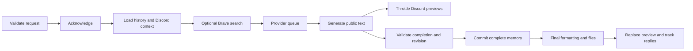

# Progress and streaming responses

Text requests now acknowledge acceptance, report actual application operations,
and update one Discord response as public answer text arrives. `/ask`, channel
messages, mentions, `/regenerate`, Regenerate buttons, edited messages and
`/summarize` use the same rendering lifecycle. Image generation and administrative
commands retain their existing flows.

## Why responses were silent

The provider interface returned only `Promise<string>`. All adapters requested
complete JSON responses, HTTP buffered the whole response, and Discord published
only after generation. Brave ran before generation with an independent timeout.
The provider queue expired callers without signalling active work to stop.
Message handlers also read conversation history a second time for thread seeding.

## Architecture and changed files

| Files | Responsibility |
| --- | --- |
| `src/ai/types.ts`, `lifecycle.ts` | Optional fourth `generate()` argument, typed events, abortable work and disposable deadlines. Existing three-argument callers and simple mocks remain valid. |
| `src/ai/http.ts`, `stream.ts` | Shared HTTP status handling, incremental UTF-8/SSE parsing, bounded reads, protocol termination, cancellation and reader cleanup. |
| `src/ai/compatible.ts`, `responses.ts`, `messages.ts`, `gemini.ts` | Protocol-specific streaming requests alongside the original JSON path; multimodal/authentication/reasoning settings are preserved. |
| `src/ai/request-queue.ts` | FIFO spacing and credential-wide cooldown remain in effect; queue expiry now aborts active work and prevents expired jobs from executing. |
| `src/memory/conversations.ts` | One text lifecycle validates acceptance, acknowledges, loads context, searches, generates, checks revision, and commits complete memory. `cancel(conversation)` cancels an active text request. |
| `src/search/types.ts`, `brave.ts` | Search accepts the parent signal and remaining deadline; existing source/context bounds and search selection remain unchanged. |
| `src/utils/discord-stream.ts`, `discord-response.ts` | New throttled preview renderer delegates complete code/file extraction and long response splitting to the existing final formatter. |
| `src/bot/create.ts`, `thread-context.ts` | All text entry points share rendering; context retrieval follows acknowledgment, reuses history, and excludes the temporary acknowledgment from thread context. Request ownership protects reply tracking when Discord deliveries finish out of order. |
| `src/utils/request-metrics.ts`, `errors.ts` | Content-free performance events and friendly incomplete/cancelled outcomes. |
| `src/config/env.ts`, `resolve-ai.ts`, `.env.example` | Custom streaming opt-in and preview edit interval. |
| `tests/streaming.test.ts`, `progress-rendering.test.ts` | Deterministic protocol, rendering, search, cancellation, isolation and bot integration coverage. Older bot/effort/conversation tests now account for payload objects, remaining deadlines and asynchronous acceptance. |

Providers emit `text_delta`, `provider_completed` and, for streaming errors,
`provider_failed`. Promise rejection remains the authoritative error channel.
Application `progress` events identify request acceptance, actual search start/end,
queue wait, generation start, response headers, first byte, first public output,
generation progress, formatting, completion, failure and cancellation. Progress
never exposes reasoning or makes claims about provider-internal tools.

## Supported protocols

* Chat Completions: `stream:true`, first-choice `delta.content`, `[DONE]`. Reasoning
  metadata and other choices are ignored. Error, length and content-filter endings
  cannot be accepted as complete answers.
* Responses: only `response.output_text.delta`; requires `response.completed`.
  Failed, incomplete and error events fail the request. `store:false` remains set.
* Messages: text content-block starts/deltas, ending in `message_stop`. Thinking,
  signatures and tool JSON remain private; existing extended-thinking budgets and
  output headroom remain intact.
* Gemini: `streamGenerateContent?alt=sse`, public candidate text parts and a valid
  `STOP` finish. Images remain inline multimodal parts; `thought` parts are ignored.

Custom gateways use the JSON compatibility path by default. Set
`CUSTOM_AI_STREAMING=true` only for gateways supporting their configured SSE
protocol. This is an owner-wide opt-in, including server custom-provider overrides.
There is no automatic retry or fallback request after a failed stream. Legacy
Groq Compound native-tool configurations retain their completion path.

The parser supports comments, multiline `data`, CR/LF/CRLF and boundaries split
at arbitrary bytes. Invalid UTF-8/JSON, missing protocol completion and unfinished
events fail safely. Limits are 128 KiB per SSE event, 8 MB per stream, the configured
public-answer character limit, and 2 MB for buffered JSON responses. Streaming
answer overflow fails explicitly rather than silently storing a truncated answer.

## Deadlines and resource management

The effort-selected deadline covers acknowledgment, history/context, Brave,
queue wait and generation. Each layer receives the remaining time and parent
signal. Queue waiting consumes total time, is separately reported, and cannot
extend the deadline. Token arrivals never reset the total deadline.

`GenerationSettings` additionally supports `connectTimeoutMs` (response-header
wait with fetch), `firstByteTimeoutMs`, `firstOutputTimeoutMs` and `idleTimeoutMs`.
Connection, first byte and first public output use the overall deadline unless
a shorter cap is explicitly supplied. After initial bytes, network inactivity
defaults to 45 seconds. The first-output cap begins after headers arrive. No
effort or output budget is automatically downgraded or increased. Existing
Anthropic headroom remains above the configured thinking budget; token-budget
exhaustion is now an incomplete result across streaming and completion paths.

Abort propagates to fetch/HTTPS, cancels body readers, releases locks/listeners,
and discards late callbacks. An expired queued job never invokes its provider.
Credential queues remain independent of unrelated credentials, and global/user
rate limits and conversation concurrency are unchanged. Failed/partial answers
never replace stored complete memory. Settings revision is checked on events
(at most once per second) and again before commit.

## Discord rendering and diagnostics

`DISCORD_EDIT_INTERVAL_MS=2500` controls previews (allowed range 2000–10000 ms).
An edit requires changed content, with an 80-character answer threshold. Only
one preview edit is in flight, preventing a backlog when Discord is slow. Final
output flushes immediately after the pending edit. All payloads disable mentions.

Previews show at most about 1900 characters in the initial message. Code fences
are withheld from previews; complete final output uses existing code-to-file
conversion. Additional messages are sent only during final splitting. Regenerate
buttons and reply IDs are applied to that final response. Regeneration/edits use
a temporary replacement; previous replies are deleted only after successful
delivery. A partial failure visibly marks the temporary reply incomplete.

One JSON `request_performance` record includes a random request ID, provider
category, acknowledgment/search/queue/header/first-byte/first-output/generation/
total durations, Discord edit count, and outcome. Missing timings mean that stage
did not run or never finished. No guild/user IDs, keys, URLs, headers, prompts,
reasoning or answer contents enter these metrics.

## Verification and live limits

Verified in this workspace on October 9, 2026: `npm run check` passed,
`npm run build` passed, and `npm test` passed all 202 tests with zero failures,
skips or cancellations (12.28 seconds). `git diff --check` also passed. Dependencies
were installed from the existing lockfile; no new packages were introduced. The
test runner required execution outside the process sandbox because its child
processes were blocked with `EPERM` inside the sandbox.

Run `npm run check`, `npm run build` and `npm test`. Tests use streaming transports,
fake clocks for the 20-second first-output scenario, controlled Discord payloads,
and existing repository mocks. No credentials or real model calls are required.
Live provider/model support, custom-gateway SSE behavior, and real Discord edit
latency/rate limiting still require deployment verification. Discord.js handles
REST rate limits; tuning the preview interval should follow measured behavior.

An arbitrary injected provider that ignores `AbortSignal` cannot have its own
JavaScript work forcibly stopped; callers still expire and late events are
rejected. The supplied HTTP adapters actively abort their upstream work. Context
retention and Brave evidence size remain unchanged to preserve answer quality.
Optional future work includes per-gateway streaming capability settings, a user
cancel command, and aggregation of performance records into latency percentiles.

Protocol references: [OpenAI streaming](https://developers.openai.com/api/docs/guides/streaming-responses),
[Messages streaming](https://platform.claude.com/docs/en/build-with-claude/streaming),
[Gemini generation](https://ai.google.dev/api/generate-content#method:-models.streamgeneratecontent),
[OpenRouter errors](https://openrouter.ai/docs/api_reference/errors-and-debugging).
Groq's [Compound documentation](https://console.groq.com/docs/compound/systems/compound)
reports that `groq/compound` was decommissioned on September 21, 2026; existing
configuration handling is preserved, but that model cannot be live-verified as
a supported Groq endpoint.
